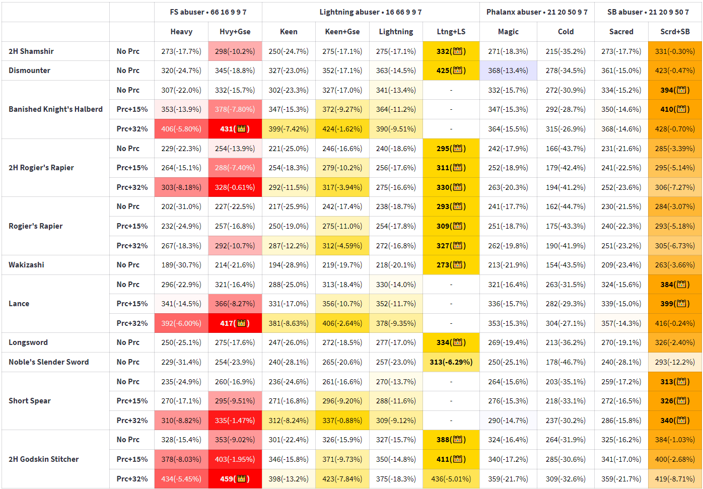

# Build-Comparator

## What is the purpose of this tool?

There are already lots of tools for build optimization, mainly in the form of spreadsheets or slugbot.
However, I could not find a way to compare whole builds together.
Usually you get tools for optimal infusion, optimal stats but always for one weapon or weapon class.
There isn't to my knowledge a way to see the damage values of a **whole inventory** across **multiple builds**. So I made one.

## So what does it actually do?

You input a list of **weapons** of your choice and as many **builds** as you like and you get a table with estimated damage that is widely customizable.
You can display counter damage, comparisons with the best infusion etc...
You can also export raw data as a CSV file or download the table as a PNG image to get a cleaner result than screenshots.

## Ok, how do I use it?

Input your weapons, builds and ennemy stats in **🛠️ Parameters**.
Then go to **🔬 Build Comparator** to see the table and change what information you want to display.
There are already some default weapons and builds so you can go straight to **🔬 Build Comparator** to see what the table looks like.

## I would like to give some feedback.

Feel free to message  **.smaxy.** on Discord.
